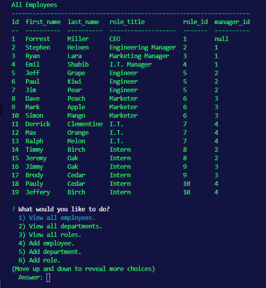

# Employee Tracker
 
 
## Languages
&ensp;&ensp;
## Description
Employee Tracker is a CLI database management tool that easily allows the user to create employees, departments and roles within a company. The user can manage employees by changing their role and their assigned mangager within Employee Tracker.

## Table of Contents
* [Installation](#Installation)
* [Usage](#Usage)
* [Contributing](#Contributing)
* [License](#License)
* [Languages](#Languages)
* [Contact](#Contact)

## Installation
RUN npm install from the root folder.

## Usage
Once the user has started the application they will be able to scroll through a list of prompts that will give them to ability to create and remove employees, roles, and departments.

## License
MIT

## Contributing
Feel free to create a pull request.

## Contact
Forrest Miller

[Click here to visit my website](http://www.forrestmillerdesign.com/)
